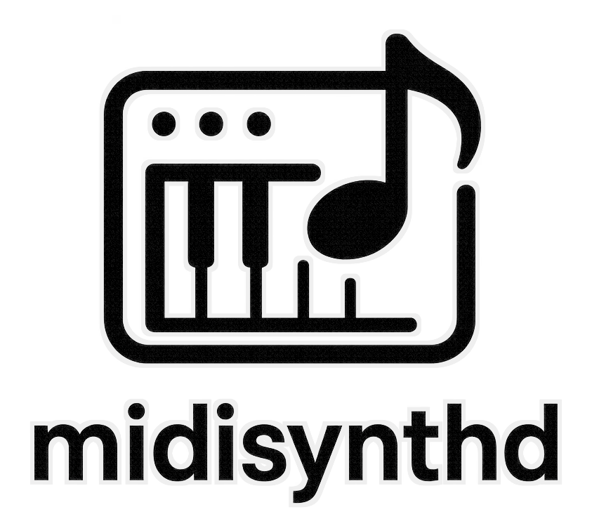
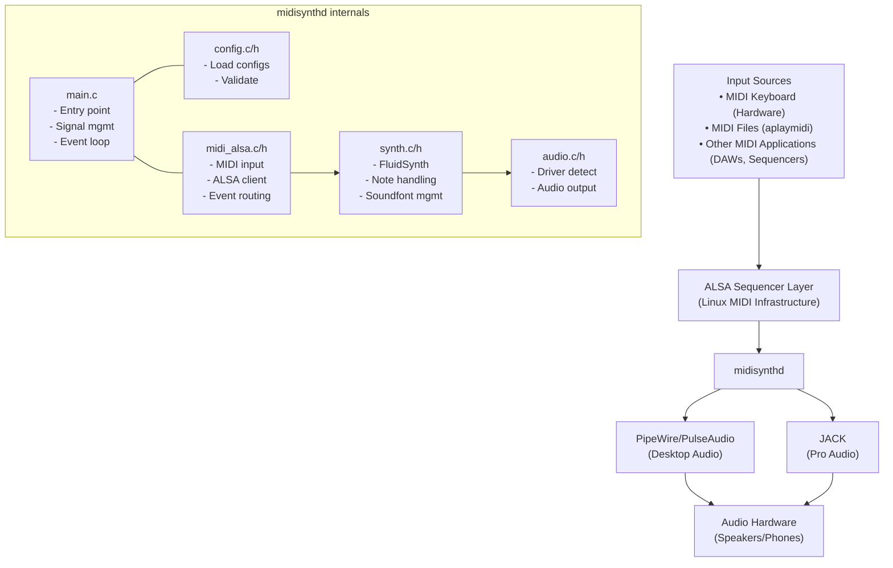

<table>
  <tr align="center">
    <td>
      
    </td>
    <td>
      <h1 style="margin:0;">midisynthd</h1>
      <p style="margin:8px 0 0;">
        <a href="https://github.com/ArchLars/midisynthd/actions">
          
        </a>
        <a href="https://github.com/ArchLars/midisynthd/releases">
          
        </a>
        <a href="https://www.gnu.org/licenses/lgpl-2.1.html">
          
        </a>
        <a href="https://www.kernel.org/">
          
        </a>
      </p>
    </td>
  </tr>
</table>

---

## 🎵 Overview

`midisynthd` is a lightweight, system-level MIDI synthesizer daemon that provides General MIDI playback on Linux systems. It runs as a background service and exposes itself as an ALSA sequencer device, allowing any MIDI-capable application to use it transparently.

### Why midisynthd?

- **Seamless Integration**: Appears as a standard ALSA MIDI device that any application can use
- **Automatic Audio Routing**: Intelligently detects and uses JACK, PipeWire, PulseAudio, or ALSA
- **Zero Configuration**: Works out-of-the-box with sensible defaults
- **System Service**: Runs automatically at startup via systemd
- **Low Latency**: Optimized for real-time MIDI playback
- **General MIDI Compatible**: Full GM instrument set with high-quality SoundFonts


## 📦 Installation

### Building from Source

#### Dependencies

- **Build Tools**: CMake (≥ 3.12), GCC/Clang, pkg-config
- **Libraries**:
  - FluidSynth (≥ 2.0)
  - ALSA (libasound2)
  - systemd (optional, for service integration)
- **Runtime**:
  - General MIDI SoundFont (e.g., FluidR3_GM.sf2)

For Debian/Ubuntu systems, install the build requirements with:

```bash
sudo apt-get install build-essential cmake pkg-config libasound2-dev \
    libfluidsynth-dev libsystemd-dev libcmocka-dev
```
 
### Project Structure
```
midisynthd/
├── src/              # Source code
│   ├── main.c       # Entry point
│   ├── synth.c/h    # FluidSynth wrapper
│   ├── audio.c/h    # Audio backend management
│   ├── midi_alsa.c/h # ALSA sequencer interface
│   └── config.c/h   # Configuration handling
├── systemd/         # Service unit files
├── config/          # Default configurations  
├── tests/           # Unit tests
└── docs/            # Documentation
```

### Signal Flow



#### Build Steps

```bash
# Clone the repository
git clone https://github.com/ArchLars/midisynthd.git
cd midisynthd

# Create build directory
mkdir build && cd build

# Configure for local installation
cmake .. -DCMAKE_INSTALL_PREFIX=$HOME/.local \
         -DCMAKE_BUILD_TYPE=Release

# Build
make -j$(nproc)

# Run tests (optional)
make test

# Install into ~/.local (no sudo needed)
make install

# Install user service file
mkdir -p ~/.config/systemd/user
cp ../systemd/midisynthd-user.service ~/.config/systemd/user/
```

## 🚀 Quick Start

### Enable and Start the Service

For most desktop users, enable the **user service**:

```bash
# Enable auto-start at login
systemctl --user enable midisynthd.service

# Start immediately
systemctl --user start midisynthd.service

# Check status
systemctl --user status midisynthd.service
```

### Verify MIDI Port

Check that the MIDI port is available:

```bash
# List MIDI ports
aconnect -l

# You should see something like:
# client 128: 'FLUID Synth (MidiSynth Daemon)' [type=user,pid=12345]
#     0 'Synth input port (MidiSynth Daemon:0)'
```

### Play a MIDI File

```bash
# Using aplaymidi (replace 128:0 with the port from `aconnect -l`)
aplaymidi -p 128:0 song.mid

# Using pmidi
pmidi -p 128:0 song.mid

# Using timidity in ALSA mode
timidity -Os song.mid
```

### Connect a MIDI Keyboard

```bash
# List available MIDI inputs
aconnect -i

# Connect your keyboard (example: port 24:0) to midisynthd (replace 128:0 with your synth port)
aconnect 24:0 128:0
```

## ⚙️ Configuration

### Configuration Files

midisynthd uses a cascading configuration system:

1. **System-wide**: `/etc/midisynthd.conf`
2. **Per-user**: `~/.config/midisynthd.conf` (overrides system settings)
3. **Built-in defaults**: Used when no config files exist

The default configuration expects the FluidR3 GM SoundFont at
`/usr/share/sounds/sf2/FluidR3_GM.sf2`. Install it from your distribution's
package repositories or change the `soundfont` path:

- **Debian/Ubuntu**: `fluid-soundfont-gm`
- **Fedora/RHEL**: `fluid-soundfont`
- **Arch Linux**: `soundfont-fluid`

### Multiple SoundFonts

Load multiple SoundFonts for layered sounds:

```ini
# Primary General MIDI SoundFont
soundfont = /usr/share/soundfonts/FluidR3_GM.sf2

# Additional SoundFonts (stacked)
soundfont = /home/user/soundfonts/strings.sf2
soundfont = /home/user/soundfonts/piano.sf2
```

### Audio Driver Selection

The `auto` driver detects in this order:
1. **JACK** - If JACK server is running
2. **PipeWire** - If PipeWire is available  
3. **PulseAudio** - If PulseAudio is running
4. **ALSA** - Direct hardware access (fallback)

Force a specific driver:
```ini
audio_driver = pipewire
```

## 📖 Advanced Usage

### Command Line Options

```bash
midisynthd [OPTIONS]

Options:
  -h, --help              Show help message
  -v, --version           Show version information
  -c, --config FILE       Use specific config file
  -d, --daemonize         Run as daemon (background)
  -V, --verbose           Enable debug logging
  -q, --quiet             Reduce log output  
  -t, --test-config       Test configuration and exit
  -s, --soundfont SF2     Override default SoundFont
  -n, --no-realtime       Disable real-time priority
  -u, --user USER         Run as specified user
  -g, --group GROUP       Run as specified group
```

### Examples

Test configuration:
```bash
midisynthd --test-config
```

Run in foreground with debug output:
```bash
midisynthd --verbose
```

Use a different SoundFont temporarily:
```bash
midisynthd --soundfont /path/to/CustomGM.sf2
```

### Integration with Applications

#### LMMS
1. Go to Edit → Settings → MIDI
2. Select "ALSA-Sequencer" as MIDI interface
3. The port "FLUID Synth (MidiSynth Daemon)" will appear in available outputs

#### Rosegarden
1. Go to Studio → Manage MIDI Devices
2. The port "FLUID Synth (MidiSynth Daemon)" appears as an available MIDI output
3. Assign tracks to use it

#### REAPER
1. Options → Preferences → MIDI Devices
2. Enable "FLUID Synth (MidiSynth Daemon)" in MIDI outputs
3. Route tracks to the synthesizer

#### Command Line Tools
```bash
# MIDI file player
wildmidi -A song.mid

# Real-time MIDI routing
aconnect "USB MIDI Keyboard" 128:0

# MIDI monitoring
aseqdump -p 128:0
```

### Troubleshooting

#### No Sound
```bash
# Check if service is running
systemctl --user status midisynthd

# Check audio system
pactl info  # For PulseAudio/PipeWire

# Verify MIDI connection
aconnect -l
```

#### High CPU Usage
- Reduce polyphony in config: `polyphony = 128`
- Increase buffer size: `buffer_size = 1024`
- Disable effects: `reverb_enabled = no`

#### Permission Issues
For real-time priority, add your user to the `audio` group:
```bash
sudo usermod -a -G audio $USER
```

#### Stuck Notes After Abort
If a MIDI player stops unexpectedly (for example when killed with `SIGKILL`),
lingering notes may continue to sound. The daemon reacts to `SIGUSR2` by
sending an *All Notes Off* message. Silence any stuck tones with:

```bash
killall -USR2 midisynthd
```

## 🛠️ Development

### Building for Development

```bash
# Debug build with sanitizers
cmake .. -DCMAKE_BUILD_TYPE=Debug \
         -DENABLE_ASAN=ON \
         -DENABLE_TESTS=ON

# Run with verbose logging
./midisynthd --verbose --config ../config/midisynthd.conf

# Run test suite
ctest --output-on-failure
```
 modern systems
- **Memory**: 50-150 MB (depending on SoundFont size)
- **Latency**: 5-20ms (configurable via buffer settings)

## 🔒 Security

- Runs as unprivileged user by default
- No network connections
- Minimal system access (audio and MIDI only)
- Follows principle of least privilege

## 📄 License

This project is licensed under the GNU Lesser General Public License v2.1 - see the [LICENSE](LICENSE) file for details.

## 🙏 Acknowledgments

- **FluidSynth** developers for the excellent synthesis engine
- **ALSA** project for Linux audio/MIDI infrastructure  
- **systemd** for modern service management
- General MIDI SoundFont creators

## 🔗 Links

- [Homepage](https://github.com/ArchLars/midisynthd)
- [Issue Tracker](https://github.com/ArchLars/midisynthd/issues)
- [Wiki](https://github.com/ArchLars/midisynthd/wiki)
- [Releases](https://github.com/ArchLars/midisynthd/releases)

---

<p align="center">
Made with ♪ for the Linux audio community
</p>
